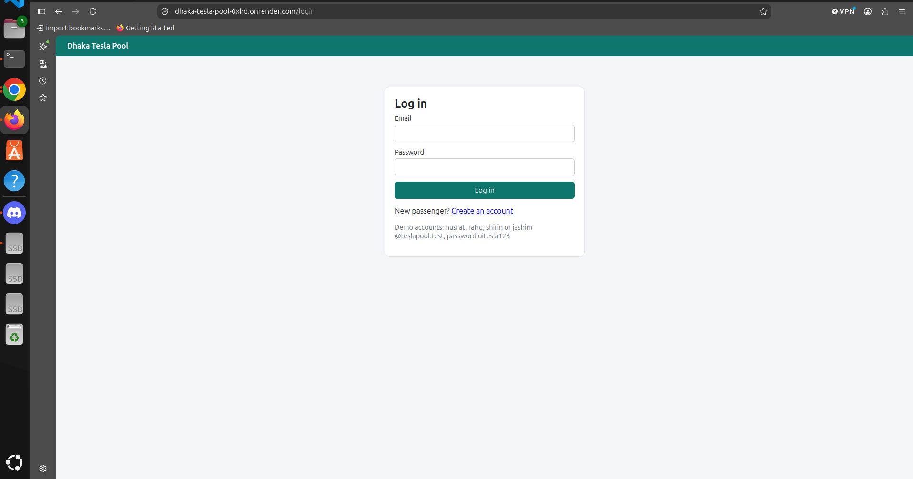
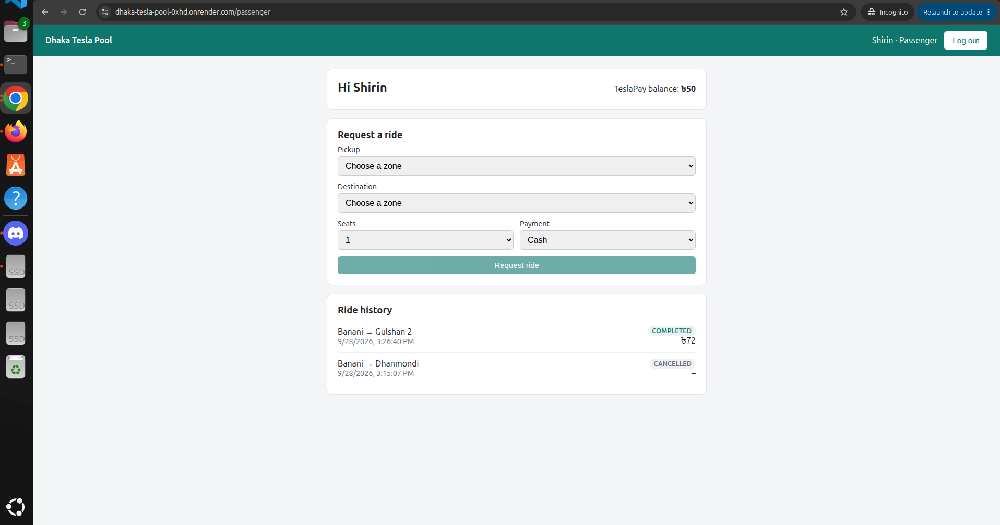
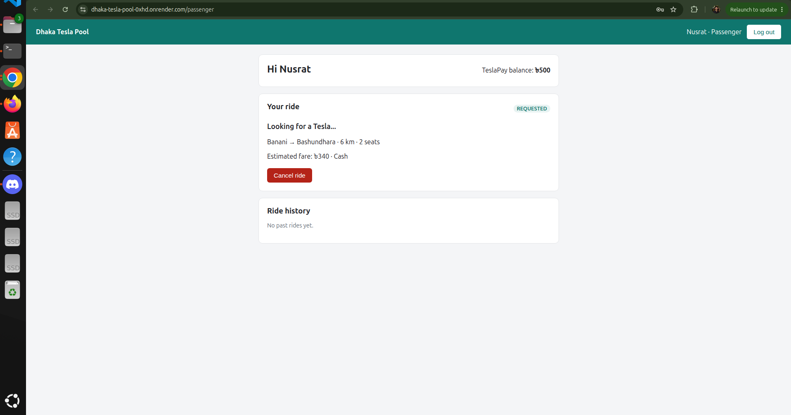
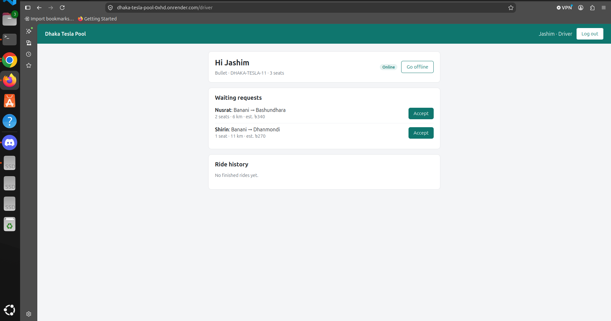
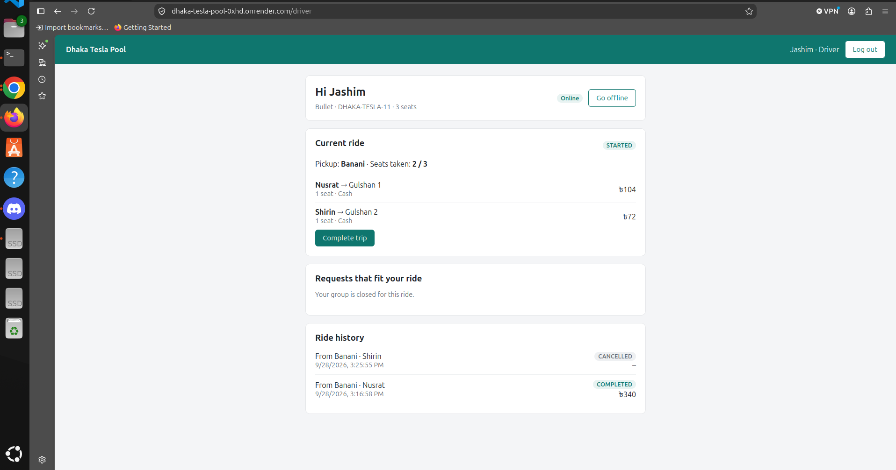
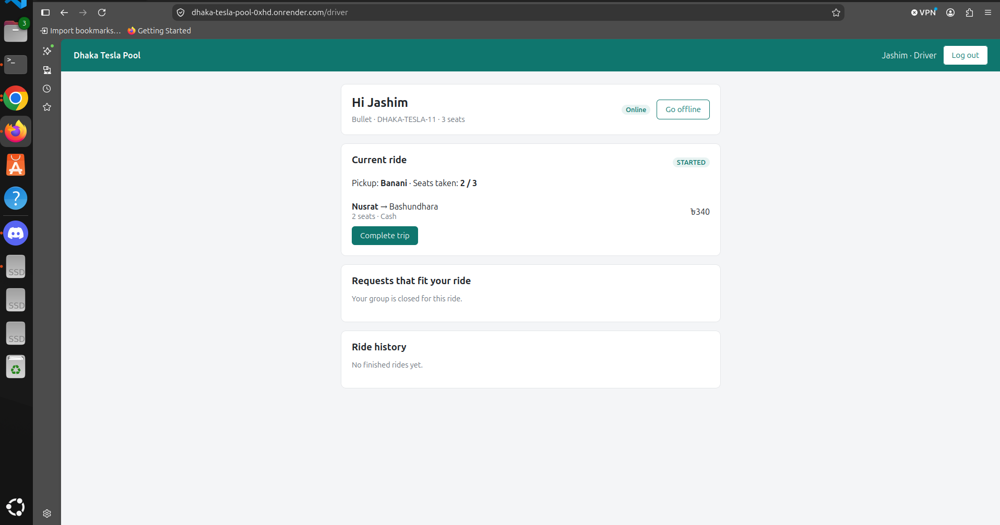
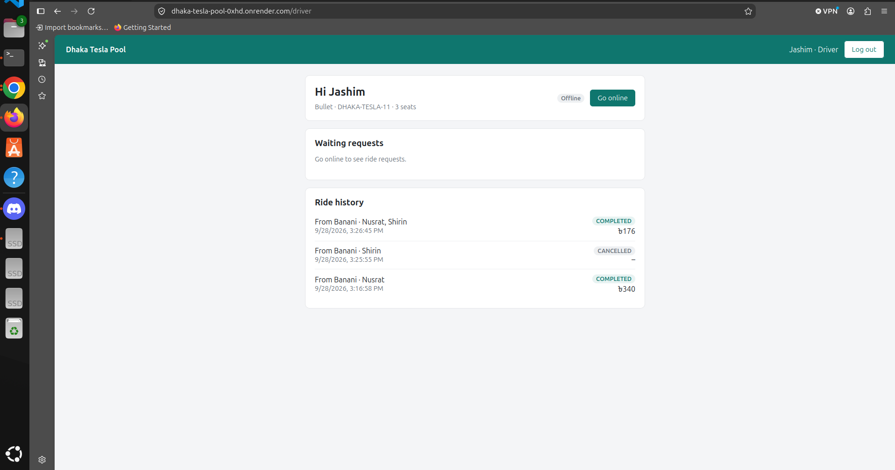

# Dhaka Tesla Pool

Share a seat. Split the fare. Survive Dhaka traffic.

A ride-pooling MVP built for the RoBenDevs internship challenge. Passengers request rides between Dhaka zones, and Jashim's three-seat Tesla "Bullet" can carry several passengers on the same trip, as long as their trips are compatible. Each passenger pays their own fare, seats can never be overbooked, and every status change is recorded.

**Demo video:** _add your link here_
**Live demo:** https://dhaka-tesla-pool-0xhd.onrender.com (free hosting: the first load can take about a minute if the server was asleep)

---

## Contents

- [Dhaka Tesla Pool](#dhaka-tesla-pool)
  - [Contents](#contents)
  - [The problem](#the-problem)
  - [Features](#features)
  - [Screenshots](#screenshots)
  - [Architecture](#architecture)
  - [Database](#database)
  - [Tech stack and why](#tech-stack-and-why)
  - [Project structure](#project-structure)
  - [Getting started](#getting-started)
    - [Prerequisites](#prerequisites)
    - [Run everything with Docker (recommended)](#run-everything-with-docker-recommended)
    - [Local development](#local-development)
    - [Useful commands (in `backend/`)](#useful-commands-in-backend)
    - [Troubleshooting](#troubleshooting)
  - [Environment variables](#environment-variables)
  - [Running tests](#running-tests)
  - [Demo accounts](#demo-accounts)
  - [API overview](#api-overview)
  - [Key decisions and trade-offs](#key-decisions-and-trade-offs)
  - [Concurrency: two people, one seat](#concurrency-two-people-one-seat)
  - [Deployment](#deployment)
  - [Known limitations](#known-limitations)
  - [Next improvements](#next-improvements)
  - [Scaling bonus: if Oi Tesla goes viral](#scaling-bonus-if-oi-tesla-goes-viral)
  - [Git workflow](#git-workflow)
  - [AI usage](#ai-usage)

---

## The problem

At 8:41 AM on Banani Road 11, Nusrat books a ride to Mohakhali. Two minutes later, Rafiq books almost the same route to Gulshan 1. Jashim's Bullet has three seats. The app has to decide quickly whether they can share, charge each of them a fair individual price, and make sure that when Shirin tries to grab the last seat at the same moment as someone else, only one of them gets it.

Three actors:

- **Passenger** (Nusrat, Rafiq, Shirin): requests a ride, sees an estimate, tracks the status, can cancel, sees history.
- **Driver** (Jashim, with Bullet): goes online, accepts rides, moves the trip through its stages, sees passengers, seats and history.
- **Ride / pool**: one trip of a vehicle that several ride requests can share, without ever exceeding its capacity.

## Features

**Passenger**
- Sign up and log in
- Pick pickup and destination zones, seats (1 to 3) and payment method (cash or simulated TeslaPay wallet)
- See the fare before requesting, including the pooled price
- Live status: waiting → matched → driver arrived → in progress → completed or cancelled (refreshes every 5 seconds)
- See the driver, the Tesla and how many people share the ride, but never other passengers' names or fares
- Cancel while waiting or matched
- Ride history and TeslaPay balance

**Driver**
- Log in, go online or offline (not allowed during an active ride)
- See waiting requests, or only the ones that fit the current ride
- Accept requests into Bullet
- See seats taken, passengers, destinations and fares
- Mark arrived → start trip → complete trip, or cancel before starting
- Ride history with the total earned per ride

**Pool / ride rules**
- Compatible requests join an open ride automatically (same pickup zone, destinations within 3 km)
- Seats can never exceed the vehicle's capacity, enforced in code and in the database
- Each passenger gets an individual fare with a 20% pool discount when sharing
- Two separate lifecycles (ride and ride request) with invalid transitions rejected
- Every change is written to an event history (`ride_events`)

## Screenshots

**Login**



**Passenger**

| Requesting a ride | Waiting for a Tesla |
|---|---|
|  |  |

**Driver**

| Waiting requests | Shared ride |
|---|---|
|  |  |

| Trip started | Ride history |
|---|---|
|  |  |
## Architecture


Editable source: [docs/diagrams/architecture.drawio](docs/diagrams/architecture.drawio)

Everything runs with Docker Compose as three containers: `web` (nginx serving the built React app), `api` (Express) and `db` (PostgreSQL).

Business rules live in one place, the backend service layer. Pure rules (distance, fares, allowed status changes) are in `backend/src/domain/` as plain functions with no database access, so they are easy to test. The database adds a final layer of protection with constraints.

More detail: [docs/architecture.md](docs/architecture.md) and [docs/design.md](docs/design.md).

## Database


Editable source: [docs/diagrams/erd.drawio](docs/diagrams/erd.drawio)

| Table | Purpose |
|---|---|
| `users` | Passengers and drivers. `role` decides which. |
| `vehicles` | Teslas like Bullet with their seat `capacity`. One per driver. |
| `zones` | The fixed list of Dhaka areas on a simple km grid. |
| `rides` | One trip of a vehicle: the pool. `seats_taken` tracks occupancy. |
| `ride_requests` | One passenger's booking and fare. `ride_id` is the pool membership. |
| `ride_events` | Append-only history of every status change. |
| `payments` | One payment per completed booking. |

Key constraints: `CHECK (seats_taken <= capacity)` on rides, one active request per passenger and one active ride per driver (partial unique indexes), a waiting request can't belong to a ride and a matched one must, money can't go negative, and a booking can't be paid twice.

Full ERD with columns and every constraint: [docs/database.md](docs/database.md).

## Tech stack and why

| Area | Choice | Alternatives considered | Why it fits this MVP | When I'd switch |
|---|---|---|---|---|
| Frontend | React + Vite + React Router | Next.js | Logged-in dashboards need no server rendering or SEO. Vite is simpler and fast. | If we needed public, search-indexed pages |
| Backend | Node.js + Express 5 | Fastify, NestJS | Most widely used, simple to explain. Express 5 passes async errors to the error handler automatically. | Fastify for raw performance, NestJS for a large team needing structure |
| Database | PostgreSQL 17 | MySQL, SQLite | Row locks for the seat race, CHECK constraints, and partial unique indexes (MySQL has none) for "one active request per passenger". SQLite locks the whole database on writes. | Keep Postgres; add PostGIS or Redis at scale |
| Data access | Knex (query builder, migrations, seeds) | Prisma, Drizzle, raw `pg` | Plain JavaScript and close to SQL, which matters because the core rules are SQL (locks, conditional updates, constraints). Prisma 7 needed TypeScript tooling and driver adapters, and Prisma 8 was still a release candidate without atomic increments. | A TypeScript rewrite, where Prisma or Drizzle add type safety |
| Validation | Zod | Joi, express-validator | Clean schemas, strips unknown fields (so `"role":"DRIVER"` can't sneak into sign-up). | Rarely |
| Auth | JWT (HS256) + bcrypt | Server sessions with cookies | Stateless and simple for a separate frontend and API. | httpOnly cookies with short-lived tokens and refresh tokens |
| Logging | Pino + pino-http | Winston, Morgan | Structured JSON logs in production, readable logs in development. Headers are never logged because they contain tokens. | Ship logs to a central store at scale |
| Tests | Node's built-in `node:test` + Supertest, against a real PostgreSQL test database | Jest, Vitest, mocked database | No extra framework. The important rules live in the database, so only a real database proves them. | Vitest if we add frontend unit tests |
| Styling | One plain CSS file | Tailwind, component libraries | Small, simple UI. Nothing to learn or configure. | When a design system is needed |
| Live updates | Polling every 5 seconds | WebSockets, Server-Sent Events | Simple and reliable at MVP size. | WebSockets at scale (see the scaling doc) |
| Containers | Docker Compose, nginx for the frontend | Kubernetes | One command runs everything. | Kubernetes or a managed container service at scale |
| Hosting | Render (API as a Docker web service, website as a static site) + Neon (PostgreSQL) | Railway, Fly.io, Vercel + Supabase | Free with no credit card. Render builds the same Dockerfile we use locally. Neon's free database doesn't expire, unlike Render's free Postgres. | A paid plan, to remove the one-minute wake-up after 15 idle minutes |

## Project structure

```
dhaka-tesla-pool/
├── backend/
│   ├── db/
│   │   ├── migrations/      schema in plain SQL
│   │   └── seeds/           zones and the story cast
│   ├── scripts/setup-db.js  migrate, and seed only an empty database
│   ├── src/
│   │   ├── domain/          pure rules: geo.js, fare.js, lifecycle.js
│   │   ├── middleware/      auth.js (JWT, roles), validate.js
│   │   ├── routes/          HTTP layer: auth, zones, rideRequests, driver, health
│   │   ├── services/        business logic: pooling, trips, requests, auth, events
│   │   ├── app.js           middleware and routes
│   │   └── server.js        starts the server, graceful shutdown
│   ├── tests/               76 tests
│   ├── Dockerfile
│   └── knexfile.js
├── frontend/
│   ├── src/
│   │   ├── pages/           Login, Register, Passenger, Driver
│   │   ├── components/      forms, ride cards, lists
│   │   ├── api.js           one place for all API calls
│   │   └── auth.jsx         logged-in user shared through React Context
│   ├── Dockerfile           build with Node, serve with nginx
│   └── nginx.conf
├── docker/postgres-init/    creates the test database on first start
├── docs/                    architecture, design, database, scaling
├── docker-compose.yml
└── .env.example
```

## Getting started

### Prerequisites

- Docker with Docker Compose
- Node.js 22 and npm (only for local development and running tests)
- Git

### Run everything with Docker (recommended)

```bash
git clone https://github.com/hossainshad/dhaka-tesla-pool.git
cd dhaka-tesla-pool
cp .env.example .env
```

Open `.env` and set at least `POSTGRES_PASSWORD` (letters and numbers only), the same password inside `DATABASE_URL` and `TEST_DATABASE_URL`, and a random `JWT_SECRET`:

```bash
node -e "console.log(require('crypto').randomBytes(32).toString('hex'))"
```

Then:

```bash
docker compose up --build -d
docker compose ps
```

When `db`, `api` and `web` show `healthy`, open **http://localhost:8080**.

On first start, the API container runs the migrations and seeds the demo data automatically. Later restarts keep your data: the seed only runs on an empty database.

### Local development

Run only the database in Docker, and the backend and frontend with hot reload:

```bash
docker compose up -d db

cd backend
npm install
npm run db:migrate
npm run db:seed
npm run dev
```

In a second terminal:

```bash
cd frontend
npm install
npm run dev
```

Open **http://localhost:5173**.

Don't run `npm run dev` for the backend while the `api` container is running: both use port 4000.

### Useful commands (in `backend/`)

| Command | What it does |
|---|---|
| `npm run dev` | API with auto-restart on file changes |
| `npm test` | All tests |
| `npm run db:migrate` | Apply migrations |
| `npm run db:seed` | Wipe all tables and load the demo cast |
| `npm run db:reset` | Roll back, migrate and seed from scratch |
| `npm run db:setup` | Migrate, and seed only if the database is empty (used by Docker) |

### Troubleshooting

- **Port 5432, 4000 or 8080 already in use:** set `POSTGRES_PORT`, `API_PORT` or `WEB_PORT` in `.env`. If you change `POSTGRES_PORT`, change the port inside `DATABASE_URL` and `TEST_DATABASE_URL` too. If you change `WEB_PORT`, add the new address to `CORS_ORIGIN`.
- **"password authentication failed":** Postgres only reads `POSTGRES_PASSWORD` when it first creates its data. Run `docker compose down -v` to start fresh (this deletes local data).
- **"Cannot reach the server" in the browser:** check that the API is running and that the site's address is listed in `CORS_ORIGIN`.

## Environment variables

All settings live in one `.env` file in the project root, used by Docker Compose, the backend and the frontend. Copy `.env.example`; never commit `.env`.

| Variable | Used by | Purpose |
|---|---|---|
| `POSTGRES_USER`, `POSTGRES_PASSWORD`, `POSTGRES_DB` | db | Database credentials |
| `POSTGRES_PORT` | db | Database port on your computer |
| `DATABASE_URL` | backend (local) | Connection string when the API runs on your computer |
| `TEST_DATABASE_URL` | tests | Separate database that tests wipe on every run |
| `PORT` | backend | Port the API listens on |
| `API_PORT` | api container | API port on your computer |
| `CORS_ORIGIN` | backend | Comma-separated website addresses allowed to call the API |
| `JWT_SECRET` | backend | Secret used to sign login tokens |
| `JWT_EXPIRES_IN` | backend | Token lifetime, e.g. `1d` |
| `TRUST_PROXY` | backend | `true` behind a hosting proxy (like Render), so rate limits use each user's real IP |
| `WEB_PORT` | web container | Website port on your computer |
| `VITE_API_URL` | frontend build | Where the browser finds the API |

## Running tests

Tests need the database running (`docker compose up -d db`). The test database is created automatically on a fresh Docker setup. On an older setup, create it once with `docker compose exec db createdb -U teslapool dhaka_tesla_pool_test`.

```bash
cd backend
npm test
```

76 tests. Each test file starts from a freshly seeded test database.

| Brief requirement | Covered in |
|---|---|
| Bullet's capacity can never be exceeded | `pooling.test.js`: code-level and database CHECK constraint |
| Invalid state transitions are rejected | `lifecycle.test.js` (pure rules) and `trip.test.js` (through the API) |
| Nusrat's and Rafiq's pooled fares calculate correctly | `fare.test.js` (৳88 and ৳104) and `trip.test.js` (end to end, with payments) |
| Users can't modify another user's ride | `rideRequests.test.js`: Rafiq gets 404 viewing or cancelling Nusrat's request |
| Cancellation rules hold | `rideRequests.test.js`, `pooling.test.js`, `trip.test.js` |
| Two concurrent requests can't corrupt pool capacity | `pooling.test.js`: Nusrat and Shirin race for the last seat, 5 rounds; Jashim double-clicking accept |

Also covered: sign-up and login security (`auth.test.js`) and the fare estimate endpoint (`estimate.test.js`).

## Demo accounts

All demo accounts use the password **`oitesla123`**.

| Name | Email | Role | Notes |
|---|---|---|---|
| Jashim | jashim@teslapool.test | Driver | Drives Bullet (plate DHAKA-TESLA-11, 3 seats) |
| Nusrat | nusrat@teslapool.test | Passenger | TeslaPay balance ৳500 |
| Rafiq | rafiq@teslapool.test | Passenger | TeslaPay balance ৳300 |
| Shirin | shirin@teslapool.test | Passenger | TeslaPay balance ৳50, too low for any ride, so she pays cash |

A quick demo: Jashim goes online. Nusrat requests Banani → Mohakhali and Jashim accepts. Rafiq requests Banani → Gulshan 1 and joins the same Bullet automatically. Jashim marks arrived, starts and completes the trip. Nusrat pays ৳88 by TeslaPay and Rafiq ৳104 in cash.

## API overview

REST with JSON. Protected routes need `Authorization: Bearer <token>`. Errors always look like:

```json
{ "error": { "code": "SEAT_TAKEN", "message": "The last seat was just taken", "details": [] } }
```

| Method | Path | Who | What |
|---|---|---|---|
| GET | `/api/health` | anyone | API and database health |
| POST | `/api/auth/register` | anyone | Passenger sign-up |
| POST | `/api/auth/login` | anyone | Log in, returns a token |
| GET | `/api/auth/me` | logged in | Own profile (drivers also get their vehicle) |
| GET | `/api/zones` | anyone | Dhaka zones |
| GET | `/api/ride-requests/estimate` | passenger | Fare quote, solo and pooled |
| POST | `/api/ride-requests` | passenger | Request a ride (joins a compatible open ride if there is one) |
| GET | `/api/ride-requests` | passenger | Own requests, newest first |
| GET | `/api/ride-requests/:id` | passenger | One own request, with ride summary |
| POST | `/api/ride-requests/:id/cancel` | passenger | Cancel own request |
| PATCH | `/api/driver/status` | driver | Go online or offline |
| GET | `/api/driver/requests` | driver | Waiting requests that fit |
| POST | `/api/driver/requests/:id/accept` | driver | Accept a request |
| GET | `/api/driver/ride` | driver | Current ride with passengers and seats |
| POST | `/api/driver/ride/arrive` | driver | Mark arrived (closes the group) |
| POST | `/api/driver/ride/start` | driver | Start the trip (locks final fares) |
| POST | `/api/driver/ride/complete` | driver | Complete the trip (records payments) |
| POST | `/api/driver/ride/cancel` | driver | Cancel before starting |
| GET | `/api/driver/rides` | driver | Ride history with earnings |

Why REST: the data is a few simple resources with clear actions, which REST handles well and which is easy to test with curl.

## Key decisions and trade-offs

**Two lifecycles instead of one.** A ride goes `OPEN → DRIVER_ARRIVED → STARTED → COMPLETED` (or `CANCELLED`), and each passenger's request goes `REQUESTED → MATCHED → IN_PROGRESS → COMPLETED` (or `CANCELLED`). This improves on the brief's single lifecycle: if Rafiq cancels, Nusrat's trip must continue. All allowed moves live in one table in `backend/src/domain/lifecycle.js`; anything else is rejected with `409`.

**Geography: zones on a km grid.** Each zone has a position on a simple grid, and distance is Manhattan distance (`|x1 − x2| + |y1 − y2|`). It always gives whole kilometres, so anyone can check fares by hand. Trade-off: not real road distances.

**Matching rule.** A request joins a ride only if the ride is still `OPEN`, the pickup zone is the same, the destination is within 3 km of every destination already in the ride, and there are enough free seats. Nusrat (Mohakhali) and Rafiq (Gulshan 1) are 1 km apart, so they share.

**Fare model.** `subtotal = (৳50 + ৳20 × km) × seats`, and 20% off when 2 or more separate bookings share the ride. Nusrat: 50 + 20 × 3 = ৳110, pooled ৳88. Rafiq: 50 + 20 × 4 = ৳130, pooled ৳104. Passengers see the solo price as the estimate, and the final fare is locked when the ride starts, so it is never higher than the estimate. The fare formula exists only on the server; the frontend asks the estimate endpoint.

**Money in integer paisa.** ৳88 is stored as `8800`. Floating-point numbers can't store most decimals exactly (`0.1 + 0.2` is `0.30000000000000004` in JavaScript). Postgres `NUMERIC` would also be exact, but JavaScript would then need a decimal library.

**Payment.** Cash, or a simulated TeslaPay wallet. The wallet must cover the estimate when requesting, and the final fare is deducted on completion. Payments are unique per booking, so no one can be charged twice.

**Drivers can't sign up.** The brief lists "sign up" only for passengers. A driver needs a vehicle, so drivers are created by the seed.

**The group closes when the driver arrives.** New passengers can join only while the ride is `OPEN`. Once Jashim is at the pickup point, the group is fixed.

**Seed only an empty database.** The seed wipes all tables, so the container runs it only when there are no users. Restarts keep real data.

**Polling instead of WebSockets.** Both pages refresh every 5 seconds. Simple and good enough for an MVP.

**Token in `localStorage`.** Simple for a separate frontend, but readable by a malicious script if the site ever had an XSS bug. Listed under known limitations.

## Concurrency: two people, one seat

Bullet has 1 free seat. Nusrat and Shirin request at the same instant, and both see it free.

1. **Lock, then check.** Joining a ride runs in a transaction that first locks the ride row (`SELECT ... FOR UPDATE`). The second transaction waits, then re-reads the ride, sees it is full, and doesn't join. Her request stays waiting.
2. **Conditional update.** The seat is claimed with `UPDATE rides SET seats_taken = seats_taken + 1 WHERE ... AND seats_taken + 1 <= capacity`. Zero rows changed means no seat.
3. **Database constraint.** `CHECK (seats_taken <= capacity)` makes overbooking impossible even with a bug.

Code always locks a ride before its requests, so two transactions can never deadlock by waiting on each other. The same approach protects a double-click on "accept" (one active ride per driver, and a request can only be matched while still waiting) and a double-tap on "request" (one active request per passenger).

`tests/pooling.test.js` fires both requests at the same time, five rounds in a row, and checks that exactly one wins. Removing the lock makes this test fail.

At larger scale: a row lock only slows down people competing for the same ride, which is a handful of people. The scaling doc covers what changes for a whole city.

## Deployment

**Live demo:** https://dhaka-tesla-pool-0xhd.onrender.com
**API health check:** https://dhaka-tesla-pool-api-t4fe.onrender.com/api/health

Everything runs on free tiers with no credit card:

| Part | Service | Notes |
|---|---|---|
| Database | Neon free PostgreSQL (Singapore) | Permanent free tier |
| API | Render free web service, built from `backend/Dockerfile` | Sleeps after 15 minutes without traffic; the next request takes about a minute to wake it |
| Website | Render static site, built from `frontend/` | Rewrite rule `/*` → `/index.html` so reloading a page like `/driver` works |

On its first start, the API migrated and seeded the empty Neon database, using the same `scripts/setup-db.js` as Docker Compose. Later restarts keep the data.

**Render settings**

| Service | Settings |
|---|---|
| API | Root directory `backend`, Docker. Environment: `DATABASE_URL` (Neon), `JWT_SECRET`, `JWT_EXPIRES_IN`, `CORS_ORIGIN` (the website URL), `TRUST_PROXY=true` |
| Website | Build command `cd frontend && npm ci && npm run build`, publish directory `frontend/dist`. Environment: `VITE_API_URL` (the API URL), `NODE_VERSION=22` |

Both services deploy the `release/v1.0.0` branch.

If the free hosting ever becomes unavailable, the whole app still runs anywhere with Docker: see [Getting started](#getting-started).

## Known limitations

- No real maps or routing: fixed zones and grid distances
- No driver location: any online driver sees all waiting requests
- One pickup zone per ride, and drop-off order isn't modelled
- Waiting requests don't expire automatically
- Live updates use polling every 5 seconds
- The login token is stored in `localStorage` (XSS risk); no refresh tokens
- A role change only takes effect when the user's token expires (1 day)
- The rate limiter keeps its counts in memory, so it resets on restart and isn't shared between several API instances
- TeslaPay is simulated: no top-ups
- No admin screen for adding drivers or vehicles
- The free API sleeps after 15 idle minutes, so the first request after that takes about a minute

## Next improvements

- Driver location and nearest-driver matching
- Expire waiting requests after a few minutes
- WebSockets for instant status updates
- httpOnly cookie sessions with refresh tokens
- Pickup and drop-off ordering, and several pickup zones per ride
- Ratings, and a ride timeline screen built from `ride_events`
- Frontend tests for the main flows

## Scaling bonus: if Oi Tesla goes viral

How the design would change for 1 million passengers and 100,000 drivers: [docs/scaling.md](docs/scaling.md).

## Git workflow

- `master`: integrated, working features
- `feature/*`: one feature each, merged into `master` with `--no-ff` so the branch stays visible in the history
- `pre-release`: integration fixes, docs and deployment checks
- `release/v1.0.0`: the version shown in the video and deployment

Commits follow `<type>(<scope>): <description>`, for example `feat(pool): add ride locking, matching check and seat claims` or `fix(build): add missing bcryptjs dependency to backend`.

## AI usage

_Edit this section in your own words. It must describe what you actually did._

**Tools:** Claude (Anthropic) as a step-by-step guide and pair programmer. _Add any other tools you used._

**What I used it for:**
- Planning the architecture, database schema and the concurrency approach before coding
- Explaining concepts I hadn't used before (row locks, partial unique indexes, JWT, multi-stage Docker builds)
- Drafting code and tests, which I then ran, read and changed
- Debugging setup problems: a port clash with another Postgres on my laptop, `.env` not being loaded, middleware in the wrong order, and a dependency installed in the wrong folder

**One suggestion I accepted:** locking the ride row before checking the matching rule and claiming a seat, backed by a conditional update and a CHECK constraint. I accepted it because the test that races Nusrat and Shirin for the last seat passes every time, and fails when the lock is removed.

**One suggestion I rejected or changed:** the first plan used Prisma as the ORM. When we checked its current state, Prisma 8 was a release candidate without atomic increments, and Prisma 7 needed TypeScript tooling and driver adapters. We switched to Knex, which keeps the important SQL (locks, conditional updates, constraints) visible and easy to explain.

**How I checked the output:** every step was run and tested on my machine, the tests cover the brief's risky cases, and I can explain each part of the code, schema and design.