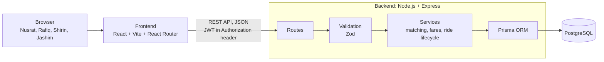

# Architecture

## System overview

Everything runs with Docker Compose as three containers: `frontend`, `api` and `db`.

## How one request flows through the system

When Nusrat taps **Request ride**:

1. The React app sends `POST /api/ride-requests` with her login token (JWT).
2. Auth middleware in Express checks the token and finds out who she is.
3. Zod validates the body: valid zones, 1 to 3 seats, a known payment method.
4. The ride service applies the business rules: fare estimate, matching with an open ride, seat capacity.
5. Prisma runs the database changes inside one transaction, so they all succeed or all fail together.
6. PostgreSQL constraints act as the last safety net: invalid data (for example, too many seats) can't be saved even if the code has a bug.

## Why this shape

**Three separate parts.** The frontend, API and database each run in their own container. Each part can be understood, tested and deployed on its own, and this matches the architecture the challenge asks for.

**Business rules live in one place.** Routes only deal with HTTP (reading the request, sending the response). React only displays data. All rules about capacity, fares and status changes live in the service layer, so they are written once and tested once.

**The database is the final guard.** Constraints like "seats taken can never exceed capacity" are enforced by PostgreSQL itself. This matters most when two requests arrive at the same moment.

**REST instead of GraphQL.** The data is a few simple resources (users, rides, ride requests) with clear actions like accept, start and complete. REST is simpler to build, easy to test with curl or Postman, and easy to explain. GraphQL helps when many different clients need very different data shapes, which isn't the case here.

**What we left out on purpose.** No Redis, message queues or microservices. One API and one database handle MVP traffic easily, and every extra piece is one more thing to run, debug and explain. The scaling bonus section explains when each of these would become worth adding.