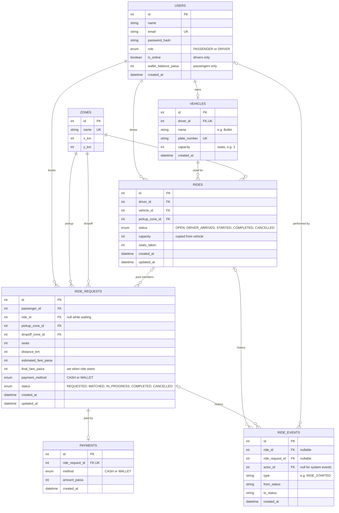

# Database design

PostgreSQL, accessed through the Knex query builder. The schema is written in plain SQL inside a Knex migration (`backend/db/migrations/*_create_schema.js`). Below: the ERD, what each table is for, and the rules the database itself enforces.

## ERD

## Tables

| Table | What it stores |
|---|---|
| `users` | Everyone who logs in. `role` decides passenger or driver. Passengers use `wallet_balance_paisa`; drivers use `is_online`. |
| `vehicles` | Teslas like Bullet and their seat `capacity`. Separate from `users` because capacity belongs to the vehicle, not the person. |
| `zones` | The fixed list of Dhaka areas and their grid positions. A real table (not hard-coded) so requests can point to zones with foreign keys. |
| `rides` | One trip of a vehicle. This is the **pool**. `seats_taken` tracks how full it is. |
| `ride_requests` | One passenger's booking, with their own fare and status. `ride_id` is the **pool membership**: empty while waiting, set once matched. |
| `ride_events` | Append-only history of every status change: who did what, and when. Used to explain exactly what happened on any ride. |
| `payments` | One row per completed booking: method and amount charged. |

## Rules the database enforces

**Capacity**

- `rides`: CHECK `seats_taken` between 0 and `capacity`. Bullet can never be overbooked.
- `rides.capacity` is copied from the vehicle when the ride is created. A CHECK constraint can only compare columns in the same row, so the capacity has to live on the ride. This also keeps old rides accurate if a vehicle's capacity changes later.
- `vehicles`: CHECK `capacity > 0`.

**One active thing at a time**

- `ride_requests`: partial unique index on `passenger_id` where status is `REQUESTED`, `MATCHED` or `IN_PROGRESS`. One active request per passenger.
- `rides`: partial unique index on `driver_id` where status is `OPEN`, `DRIVER_ARRIVED` or `STARTED`. One active ride per driver.
- `vehicles.driver_id`: UNIQUE. One vehicle per driver.

**Valid data**

- `ride_requests`: CHECK `seats` between 1 and 3, and CHECK pickup zone is different from dropoff zone.
- `ride_requests`: CHECK that a waiting (`REQUESTED`) request has no ride, and a `MATCHED`, `IN_PROGRESS` or `COMPLETED` request always has one.
- Status-like columns (`role`, `status`, `payment_method`) are `TEXT` with a CHECK listing the allowed values. This works like an enum but is easier to change later.
- All money columns: CHECK `>= 0`.
- `payments.ride_request_id`: UNIQUE. A booking can never be charged twice.
- Foreign keys use `ON DELETE RESTRICT`, so history can't be silently deleted.

**Indexes for common queries**

- `rides(status, pickup_zone_id)`: finding open rides to match with.
- `ride_requests(status, pickup_zone_id)`: the driver's list of waiting requests.
- `ride_requests(passenger_id, created_at)`: a passenger's ride history.
- `rides(driver_id, created_at)`: a driver's ride history.
- `ride_requests(ride_id)`: listing the passengers in a pool.
- `ride_events(ride_id)` and `ride_events(ride_request_id)`: showing a ride's timeline.