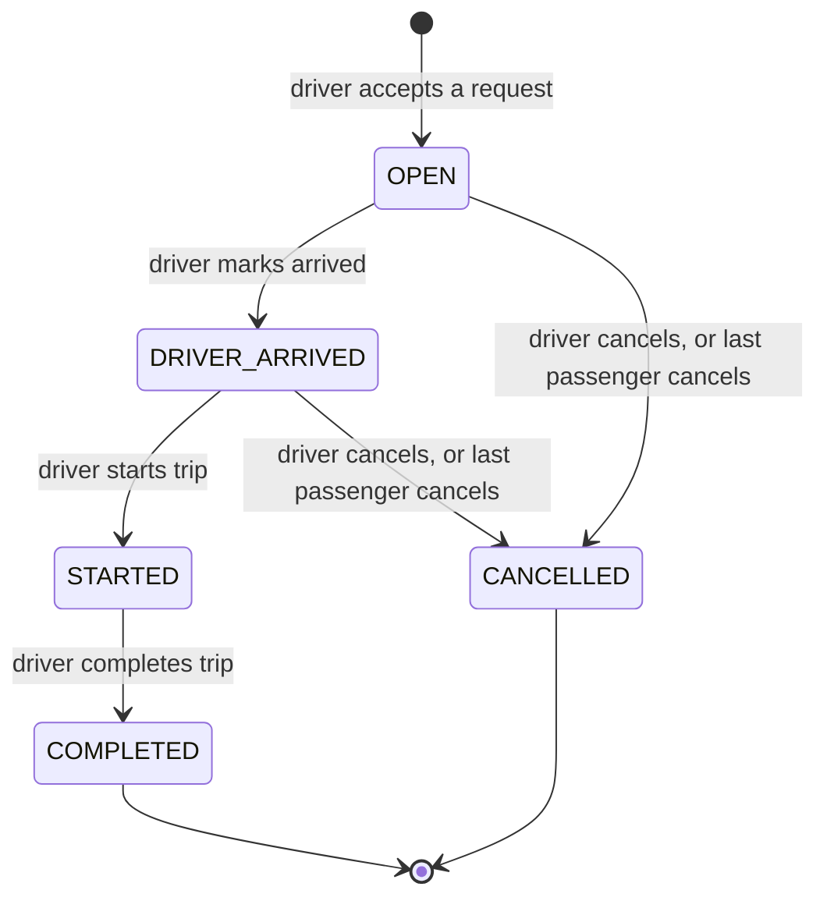
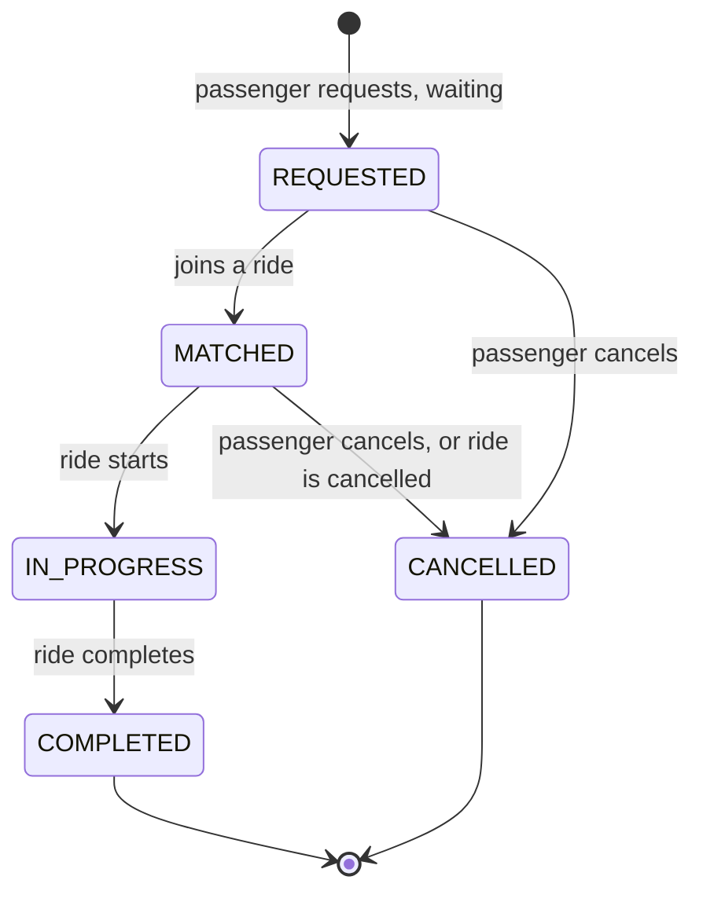

# Design decisions

The rules the app follows. Each rule here is implemented in the backend and covered by tests.

## 1. Geography: zones on a simple grid

No real maps or routing. Dhaka is simplified to a fixed list of zones. Each zone sits on a grid measured in kilometres (x = east, y = north), placed roughly where it is in real Dhaka.

| Zone | x (km) | y (km) |
|---|---|---|
| Dhanmondi | 0 | 0 |
| Farmgate | 2 | 1 |
| Mohakhali | 4 | 4 |
| Gulshan 1 | 5 | 4 |
| Gulshan 2 | 5 | 6 |
| Banani | 4 | 7 |
| Mirpur | 0 | 9 |
| Bashundhara | 8 | 9 |
| Uttara | 3 | 18 |

**Distance** between two zones = `|x1 - x2| + |y1 - y2|`. This is called Manhattan distance: you move along streets instead of flying in a straight line over buildings. It always gives whole kilometres, so anyone can check it by hand.

- Banani (4, 7) → Mohakhali (4, 4) = 0 + 3 = **3 km**
- Banani (4, 7) → Gulshan 1 (5, 4) = 1 + 3 = **4 km**

Known limitation: these are not real road distances.

## 2. Matching rule: who can share Bullet

A request can join an existing ride only if **all** of these are true:

1. The ride is `OPEN` (Jashim has accepted it but hasn't arrived at pickup yet).
2. The request has the same pickup zone as the ride.
3. The request's destination is **within 3 km** of every destination already in the ride.
4. The ride has enough free seats.

**Nusrat and Rafiq:** both start in Banani. Their destinations, Mohakhali (4, 4) and Gulshan 1 (5, 4), are 1 km apart. 1 km is within 3 km, so they can share Bullet.

**Counter-example:** a Banani → Dhanmondi request can't join them, because Dhanmondi (0, 0) is 8 km from Mohakhali.

### How a request gets matched

- When a passenger requests a ride, the system looks for a compatible `OPEN` ride and joins it automatically.
- If there isn't one, the request waits with status `REQUESTED`.
- Online drivers see waiting requests. When Jashim accepts one, it either starts a new ride or joins his current `OPEN` ride (only if it passes the rule above).
- By accepting a ride, the driver agrees to pooling: compatible passengers can join until he marks himself as arrived. After that, the group is closed.

## 3. Fare model

```
subtotal     = (baseFare + perKmRate × distanceKm) × seats
poolDiscount = 20% of subtotal, only if the ride has 2 or more passengers when it starts
fare         = subtotal - poolDiscount
```

| Setting | Value |
|---|---|
| baseFare | ৳50 (5,000 paisa) |
| perKmRate | ৳20 per km (2,000 paisa) |
| poolDiscount | 20% of subtotal |

"2 or more passengers" means 2 or more separate bookings. Nusrat booking 2 seats for herself alone doesn't count as sharing.

### Worked example: Nusrat and Rafiq share Bullet

| | Nusrat | Rafiq |
|---|---|---|
| Trip | Banani → Mohakhali | Banani → Gulshan 1 |
| Distance | 3 km | 4 km |
| Subtotal | 50 + 20 × 3 = ৳110 | 50 + 20 × 4 = ৳130 |
| Pool discount (20%) | ৳22 | ৳26 |
| **Final fare** | **৳88** (stored as 8800) | **৳104** (stored as 10400) |

If Nusrat had ridden alone, she would pay ৳110.

### Estimated vs final fare

- **Estimated fare** (shown when requesting): the solo price, without discount, because we don't know yet whether someone will share.
- **Final fare** (locked when the ride starts): by then the group can't change, so we know whether the discount applies.

So the final fare is never higher than the estimate.

## 4. Money is stored as integer paisa

Every amount is a whole number of paisa (৳1 = 100 paisa). ৳88 is stored as `8800`.

**Why:** computers can't store most decimal numbers exactly. In JavaScript, `0.1 + 0.2` gives `0.30000000000000004`. Small errors like this add up when handling money. Whole numbers are always exact.

**Alternative:** PostgreSQL's `NUMERIC` type is also exact, but JavaScript would still need a decimal library to do the math. Integers are simpler.

**Rounding:** the discount is calculated with integer math and rounded down to whole paisa: `Math.floor(subtotal * 20 / 100)`. With whole-km distances, the numbers always come out exact anyway.

**When we'd switch:** if we needed multiple currencies or fractional rates (like 7.5% tax), we'd move to `NUMERIC` with a decimal library.

## 5. Payment

Passengers choose **Cash** or **TeslaPay** (a simulated wallet; demo passengers start with a balance). There is no real payment gateway.

- **TeslaPay:** the wallet must cover the estimated fare when requesting. The final fare is deducted when the ride completes.
- **Cash:** recorded as paid to the driver when the ride completes.

Either way, one payment record is saved per completed booking.

## 6. Two lifecycles instead of one

A pooled ride has several passengers, so we track two separate statuses:

- the **ride**: Bullet's trip, controlled by Jashim
- each **ride request**: one passenger's booking inside that ride

**Why this improves on a single status:** if Rafiq cancels, Nusrat's trip must continue. One shared status can't express "cancelled for Rafiq, still going for Nusrat."

### Ride status



### Ride request status (what the passenger sees)



### How the two connect

- Jashim can mark arrived only if the ride has at least one passenger.
- When the ride starts, all its `MATCHED` requests become `IN_PROGRESS` and their final fares are locked.
- When the ride completes, all its requests become `COMPLETED` and payments are recorded.
- When a ride is cancelled, all its active requests become `CANCELLED`.

Any status change not shown in the diagrams is rejected by the API with `409 Conflict`. For example, Jashim can't complete a ride that never started.

## 7. Cancellation rules

- A passenger can cancel **only their own** request, and only while it's `REQUESTED` or `MATCHED`. Cancelling frees their seats.
- If the last passenger in a ride cancels, the ride becomes `CANCELLED`.
- Jashim can cancel his ride while it's `OPEN` or `DRIVER_ARRIVED`.
- Nobody can cancel once the trip has started.

## 8. Concurrency: two passengers, one seat

**The problem:** Bullet has 1 free seat. Nusrat and Shirin request at almost the same instant, and both see 1 seat available.

**The solution:** a seat is claimed with a single database update that only succeeds if the seat is still free:

```sql
UPDATE rides
SET seats_taken = seats_taken + 1
WHERE id = 42
  AND status = 'OPEN'
  AND seats_taken + 1 <= capacity;
```

PostgreSQL locks the ride's row while one update is running, so the two updates happen one after the other, never at the same time:

1. Nusrat's update runs first: the seat is free, so it succeeds (1 row changed).
2. Shirin's update waits, then re-checks the condition. The ride is now full, so it changes 0 rows.
3. The API sees 0 rows changed and keeps Shirin's request `REQUESTED` (waiting), with a message that the last seat was just taken.

**Safety net:** a CHECK constraint (`seats_taken <= capacity`) in the database makes overbooking impossible even if the code had a bug.

The same idea protects other races:

- **Two drivers accept the same request:** the update only succeeds `WHERE status = 'REQUESTED'`, so only one can win.
- **Double-tapping "Request ride":** a unique index allows only one active request per passenger.

**At larger scale:** row locks only become a bottleneck when many people fight over the same ride at once. Handling this for a city-wide system is covered in the scaling bonus section.

## 9. Assumptions

- Each driver owns exactly one vehicle. Bullet has 3 seats.
- A passenger can book 1 to 3 seats per request, and can have only one active request at a time.
- All passengers in a ride are picked up in the same zone. Drop-off order is not modelled.
- There is no driver location: any online driver sees all waiting requests.
- A driver can't go offline during an active ride.
- Waiting requests don't expire automatically.