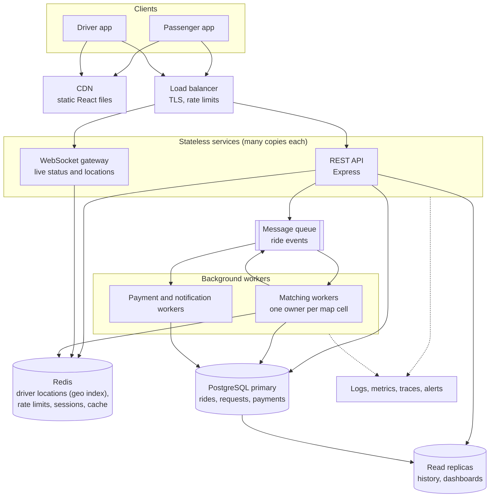

# If Oi Tesla goes viral: scaling to 1M passengers and 100k drivers

This is design reasoning, not implemented code. The MVP deliberately stays simple (one API, one database). This document explains what would break first as Dhaka Tesla Pool grows, and what I would change, in the order I would change it.

## 1. Start with numbers

Rough, deliberately pessimistic estimates for a busy morning peak:

| What | Estimate | Why it matters |
|---|---|---|
| Passengers | 1,000,000 registered, about 150,000 active on a busy day | Most users are idle most of the time |
| Ride requests at peak | about 100 per second | 150k requests spread over a 2-hour rush, with bursts |
| Drivers online at peak | about 30,000 of the 100,000 | Not everyone drives at once |
| Driver location updates | 30,000 drivers × 1 update every 4 s = **7,500 writes per second** | The biggest load by far |
| Status checks with polling | 150,000 open apps × 1 check every 5 s = **30,000 reads per second** | Why polling must go |

Two conclusions shape everything below:

1. **Ride requests are not the hard part.** About 100 per second is fine for a single well-indexed PostgreSQL.
2. **Driver locations and status polling are.** They are huge in volume, short-lived, and don't need to be stored forever. They should not go through PostgreSQL at all.

## 2. Target architecture

## 3. Topic by topic

### Load balancing and horizontal scaling

The API is already **stateless**: the JWT carries who you are, so any copy of the API can serve any request. That means scaling is "run more copies behind a load balancer". The load balancer also terminates HTTPS, checks `/api/health` and removes unhealthy copies.

What must change first: the rate limiter currently counts in the memory of one process. With 20 copies, each would allow 10 failed logins, so counts move to **Redis**, shared by all copies.

### Real-time communication

Polling every 5 seconds becomes 30,000 requests per second of mostly "nothing changed". Replace it with a **WebSocket gateway**: the app opens one connection and the server pushes changes ("Jashim has arrived"). Gateways are separate from the API so they can scale on their own, and they learn about changes from the message queue. Server-Sent Events are a simpler alternative for one-way updates.

### Driver locations and geospatial search

7,500 location updates per second is too much write load for the main database, and the data is only useful for a few seconds. Store the latest position of each online driver in **Redis's geo index** (`GEOADD`, then `GEOSEARCH` for "drivers within 2 km"). Only trip-level facts (pickup, drop-off, route summary) go to PostgreSQL.

The fixed zones become a real grid of map cells, for example **H3 hexagons** or geohashes. "Same pickup zone" becomes "same or neighbouring cell", and "destinations within 3 km" becomes a real distance check. PostGIS would be the choice if we needed complex geographic queries on stored data.

### Ride matching

Today, a request joins the first compatible open ride. At scale:

- **Partition matching by map cell.** Each cell (a few city blocks) is owned by exactly one matching worker at a time. All matching decisions for Banani happen in one place, so they don't fight each other for database locks.
- **Match in small batches.** Instead of first-come-first-served, a worker collects requests for one or two seconds and then picks the best grouping (shortest detours, fullest cars). This gives better pools for a small delay.
- Requests reach the worker through the queue; the worker writes the result to PostgreSQL and publishes a "matched" event that the WebSocket gateway delivers.

### Database contention

The MVP locks one ride row while someone joins. That scales well, because only people competing for **the same ride** wait, which is a handful of people. What would not scale is many API copies all searching the same open rides at once. Moving matching into per-cell workers (above) removes that contention: one writer per cell means almost no lock waiting.

Other database changes:

- **Indexes** already match the main queries (open rides by pickup zone, waiting requests, history by user). At scale, add indexes after measuring real slow queries, not before.
- **Read replicas** for history screens, driver earnings and dashboards, so they don't slow down the primary that handles bookings.
- **Partitioning** `ride_events` and `ride_requests` by month, because history grows forever while active data stays small. Old partitions move to cheap storage.
- A **connection pooler** (PgBouncer), because hundreds of API copies can't each hold many database connections.
- If one city outgrows one primary, **shard by city**: Dhaka and Chattogram rarely share a ride.

### Queues and events

Things that don't need to happen before the user gets an answer move to a **message queue**: payment processing, notifications, receipts, analytics. The API writes the ride change and an "outbox" row in the same transaction, and a relay publishes the outbox to the queue. This **outbox pattern** means an event is never lost and never sent for a change that was rolled back. It builds naturally on the `ride_events` table we already have.

### Caching

Cache what rarely changes and is read constantly: zones or map cells, fare settings, vehicle details. Use Redis with a short expiry. Never cache seat counts or ride status for decisions; those must come from the source of truth.

### Rate limiting

Redis-backed limits at the load balancer and in the API: per IP for login and sign-up, per user for ride requests (a person doesn't need 50 requests a minute), and per driver for location updates.

### Idempotency

Mobile networks drop connections, and apps retry. `POST /api/ride-requests` accepts an `Idempotency-Key` header; the server stores the key with the result, so a retry returns the same ride request instead of creating a second one. The MVP already has a safety net for this (one active request per passenger), but an idempotency key also returns the correct response to the retry. Payments get the same treatment: one payment per booking is already enforced by a unique constraint.

### Retry and failure strategy

- Retry only safe or idempotent operations, with exponential backoff and jitter so thousands of clients don't retry at the same moment.
- Failed queue messages go to a **dead-letter queue** to be inspected, not retried forever.
- **Circuit breakers** around slow dependencies (for example a payment provider), so one failing service doesn't make every request hang.
- **Graceful degradation:** if matching is slow, show "still looking" rather than an error; if history replicas are down, the booking flow still works.

### Observability

- Structured JSON logs (already in place with Pino) shipped to a central store, with a request id on every log line.
- Metrics: request rate, error rate and latency per endpoint; matching time; seats offered versus filled; queue lengths.
- Distributed tracing across API, queue and workers to see where a slow ride request spent its time.
- Alerts on user-facing symptoms: "ride requests taking more than 10 s to match", "payment failures above 1%".

### Security

- Secrets in a secrets manager, rotated regularly, instead of `.env` files.
- Short-lived access tokens with refresh tokens in httpOnly cookies, replacing the long-lived token in `localStorage`.
- A web application firewall and bot protection in front of login and sign-up.
- Least-privilege database users: workers can only touch the tables they need.
- Audit logs for driver and payment changes, which `ride_events` already starts.

### Deployment strategy

- Containers on a managed platform (Kubernetes or a managed container service) with autoscaling on CPU and request rate.
- **Rolling or blue-green deployments**: start the new version, send it a little traffic, and shift over only if error rates stay normal.
- **Backward-compatible migrations** (expand, then contract): add a new column, deploy code that uses it, and remove the old column only in a later release. Old and new code must work with the same database during a deploy.
- Separate staging environment with production-like data volumes for load testing before big releases.

## 4. What I would do first

Scale in the order problems actually appear, not all at once:

1. **Replace polling with WebSockets**, and move rate limits to Redis. Cheapest change with the biggest effect.
2. **Add driver locations in Redis** and nearest-driver matching.
3. **Run several API copies** behind a load balancer, add PgBouncer and a read replica for history.
4. **Move matching to per-cell workers** with a queue and the outbox pattern.
5. **Partition history tables**, then shard by city only when one database is truly not enough.

Every step is driven by measurements from the observability stack, so we add complexity only when there's a reason for it.
